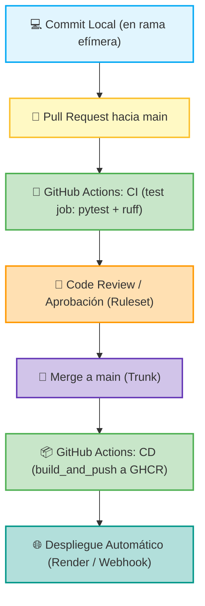

# Scrum + Trunk-Based Development (TBD) Playbook
**Equipo de Desarrollo — INGENIERO-JUAN / CICD**  
*Adaptación de Scrum a entornos de Despliegue Continuo (CD) y Trunk-Based Development*

---

## 1. Diagnóstico del Flujo Actual (Ejercicio de Miro)

### 1.1 Mapa Visual del Flujo de Trabajo

### 1.2 Mapa de Calor de Fricciones y Cuellos de Botella
* 🟢 **Lo que funciona bien:**
  * Ejecución automática de pruebas unitarias (`pytest`) y linter (`ruff`) en menos de 10 segundos por cada Pull Request.
  * Generación y publicación automática del contenedor Docker en GitHub Container Registry (`ghcr.io/ingeniero-juan/cicd:latest`) inmediatamente tras cada merge a `main`.
* 🟡 **Lo que genera fricción:**
  * Tiempos de espera en revisiones de código manuales (*Code Review*): si los compañeros están ocupados, el PR se estanca y la rama envejece.
  * Sincronización manual de ramas cuando la rama `main` avanza rápido.
* 🔴 **Lo que rompe el flujo o genera miedo:**
  * Miedo a integrar código incompleto a `main` y romper el entorno de producción.  
    *(Solución implementada: **Feature Flags con ConfigCat** para desacoplar el despliegue de la activación funcional).*

### 1.3 Respuestas al Diagnóstico Rápido
1. **¿Cuánto tiempo vive normalmente una rama?**  
   *Máximo entre 4 y 24 horas*. En TBD no existen ramas de días o semanas; si una tarea es grande, se divide (*sliceado*) para que entre en una rama de corta vida (*short-lived branch*).
2. **¿Qué tan seguido integramos realmente a `main`?**  
   *Al menos una vez al día por cada desarrollador*.
3. **¿Nuestro DoD actual incluye "está en `main` y es desplegable"?**  
   *Sí, absolutamente*. El trabajo no se considera terminado si solo funciona en la máquina del desarrollador.

---

## 2. Roles Adaptados a TBD + Continuous Deployment

| Rol | Responsabilidad Tradicional | Adaptación a TBD + Despliegue Continuo |
| :--- | :--- | :--- |
| **Product Owner (PO)** | Prioriza historias grandes para entregar al final de 2 semanas de Sprint. | Prioriza por valor, riesgo de despliegue y tamaño del lote (*batch*). Participa activamente en el *sliceado* de historias y decide la estrategia de encendido gradual de *Feature Toggles* (0% ➔ 10% ➔ 100%). |
| **Developers** | Desarrollan funcionalidades completas en ramas aisladas durante días. | Responsabilidad colectiva de mantener `main` siempre verde y desplegable. Integraciones diarias con commits pequeños. Monitoreo activo y ownership del pipeline de CI/CD. |
| **Scrum Master** | Facilita ceremonias clásicas y pregunta qué se hizo ayer. | Facilita la disciplina de integración continua diaria. Elimina el miedo a romper `main` promoviendo pruebas automatizadas robustas. Protege tiempo técnico para mejorar la infraestructura y el pipeline. |

### Compromiso en Post-it (Ejercicio práctico):
* **Product Owner:** *"A partir de mañana definiré criterios de aceptación específicos para Feature Flags y validaré valor en producción con usuarios reales antes de cerrar el Sprint."*
* **Developer:** *"A partir de mañana no tendré ramas abiertas por más de 24 horas; si mi código no está listo para el usuario final, lo ocultaré tras un toggle pero lo integraré a `main` ese mismo día."*
* **Scrum Master:** *"A partir de mañana monitorearé la salud del pipeline y aseguraré que cualquier falla en `main` sea atendida de inmediato por el equipo como máxima prioridad."*

---

## 3. Artefactos y Ceremonias Adaptadas

### 3.1 Tabla Comparativa: Clásica vs. Adaptación TBD + CD

| Artefacto / Ceremonia | Versión Clásica | Adaptación TBD + CD |
| :--- | :--- | :--- |
| **Product Backlog** | Lista de historias de usuario completas y extensas. | Historias rebanadas (*sliceadas*) en incrementos mínimos integrables + plan de Feature Toggle + criterios de aceptación validables en producción. |
| **Sprint Backlog** | Paquete de trabajo cerrado comprometido para todo el sprint. | Flujo de trabajo continuo que se planea integrar a `main` diariamente. |
| **Incremento** | Entregable único acumulado al final de las 2-3 semanas de Sprint. | Cualquier commit que entre a `main` y apruebe el CI es un **Incremento Potencialmente Desplegable**. |
| **Daily Scrum** | Tres preguntas: ¿Qué hice ayer? ¿Qué haré hoy? ¿Qué impedimentos tengo? | Enfoque en integración: **"¿Qué voy a integrar hoy a `main` y qué pruebas necesito para que la integración sea 100% segura?"**. |
| **Sprint Review** | Demostración de maquetas o código en entorno local/staging. | Demostración del software **realmente desplegado en producción**, encendiendo o apagando Feature Toggles en vivo y mostrando métricas reales de uso. |
| **Sprint Retrospective** | Conversación sobre relaciones y procesos genéricos de equipo. | Análisis de salud del pipeline: tiempo de ejecución de CI, frecuencia de despliegues, tasa de fallos en `main` (*Change Failure Rate*) y disciplina de TBD. |

---

### 3.2 Actividad "Traduce tu Realidad" (Re-escritura de Historias Sliceadas)

Tomando las 3 historias reales creadas en nuestro repositorio:

#### Historia 1 (Issue #2): Método Backend detrás del Toggle
* **Historia original:** "Como usuario quiero poder restar dos números para calcular diferencias."
* **Re-escritura TBD + CD:**
  * *Como* desarrollador,
  * *Quiero* implementar el método `resta()` en `Calculator` cubierto por un Feature Flag apagado (`rollout 0%`),
  * *Para* integrar la lógica al tronco principal (`main`) sin exponer la funcionalidad prematuramente a los usuarios.
  * **Criterios de Aceptación (AC) en Producción:**
    * Método `resta(a, b)` implementado en `src/main.py`.
    * Suite de pruebas unitarias en `src/tests.py` ejecutándose exitosamente en CI (`pytest`).
    * Flag `feature-resta` creado en ConfigCat y configurado en `False` (0% de exposición).

#### Historia 2 (Issue #3): Exposición en Frontend con Rollout Interno
* **Re-escritura TBD + CD:**
  * *Como* Product Owner,
  * *Quiero* conectar la interfaz web al método de resta visible solo para el 10% de usuarios de prueba,
  * *Para* validar la experiencia de usuario y telemetría en producción antes del lanzamiento global.
  * **Criterios de Aceptación (AC) en Producción:**
    * Componente visual de resta presente en la interfaz web.
    * Feature flag en ConfigCat configurado con regla de segmentación al 10% de usuarios.
    * Sin errores de JavaScript o excepciones en la consola de producción.

#### Historia 3 (Issue #4): Operaciones Restantes y Lanzamiento 100%
* **Re-escritura TBD + CD:**
  * *Como* usuario final,
  * *Quiero* disponer de multiplicación, división e historial con el feature flag abierto al 100%,
  * *Para* utilizar la calculadora completa de forma estable y verificada.
  * **Criterios de Aceptación (AC) en Producción:**
    * Operaciones `multiplicacion` y `division` cubiertas por pruebas unitarias al 100%.
    * Validación de división por cero controlada.
    * Flag de ConfigCat activado al 100% de la base de usuarios.
    * Eliminación planificada de la deuda técnica del Feature Flag tras la estabilización.

### Pregunta de Cierre:
> **¿Cómo cambia nuestro Sprint Review y nuestra Retrospective con esta nueva forma de trabajar?**  
> * **En el Sprint Review:** Ya no nos limitamos a "mostrar una demo en la máquina del desarrollador" con el riesgo de que falle al desplegar; abrimos la aplicación real en producción y mostramos cómo el Product Owner puede activar y desactivar funcionalidades en tiempo real desde ConfigCat.
> * **En la Retrospective:** Analizamos datos objetivos de ingeniería: ¿cuánto tardaron los PRs en revisarse?, ¿falló alguna vez el job de `test` en `main`?, ¿alguna rama tardó más de un día en integrarse? La mejora continua se apoya en métricas reales de entrega de software.

---

## 4. Scrum + TBD Playbook (Reglamento Oficial del Equipo)

### 4.1 Cinco Principios Fundamentales
1. **La rama `main` es sagrada:** `main` debe mantenerse en todo momento verde, libre de errores y en estado 100% desplegable.
2. **Ramas efímeras (*Short-lived branches*):** Ninguna rama de trabajo vive más de 24 horas. Todo trabajo se divide en lotes pequeños.
3. **Desacoplar Despliegue de Lanzamiento:** Desplegar código a `main` no significa mostrárselo a los clientes; usamos *Feature Flags* para controlar la activación funcional.
4. **Prioridad absoluta al fallo de CI:** Si un commit en `main` rompe las pruebas, todo el equipo detiene nuevas integraciones hasta que el pipeline vuelva a estar en verde.
5. **No hay código terminado sin pruebas:** Ningún PR puede fusionarse sin pruebas unitarias automatizadas que respalden los cambios.

### 4.2 Reglas de Oro de Integración a `main`
* **Cero commits directos a `main`:** Todo cambio debe entrar mediante un Pull Request.
* **Status Check obligatorio:** El job `test` (linter `ruff` + `pytest`) debe estar aprobado en verde antes del merge.
* **Prohibido el `push --force`:** El historial de `main` es inmutable y no se reescribe.
* **Higiene estricta de ramas:** Apenas se confirma el estado "Merged" en GitHub, la rama local y remota se eliminan inmediatamente (`git branch -D` y `git push origin --delete`).

### 4.3 Definition of Done (DoD) Preliminar

#### DoD Técnico
* [ ] Código compatible con estándares de formato y linter (`ruff check .` pasa sin errores).
* [ ] Pruebas unitarias escritas y pasando al 100% en GitHub Actions (`pytest tests.py`).
* [ ] Imagen Docker compilada y publicada exitosamente en GitHub Container Registry (`GHCR`).
* [ ] Pull Request revisado y fusionado a `main`.
* [ ] Rama efímera eliminada en local y remoto.

#### DoD de Negocio
* [ ] Criterios de aceptación de la historia de usuario cumplidos.
* [ ] Feature Flag configurado adecuadamente en ConfigCat (0%, 10% o 100% según la etapa acordada con el PO).
* [ ] Telemetría y registros de ejecución verificados sin alertas de error en producción.

### 4.4 Adaptación de Ceremonias
* **Daily Scrum (15 min):** El tablero de GitHub Projects se revisa de derecha a izquierda. La pregunta central es: *"¿Qué Pull Request está listo para mergearse hoy a `main` y cómo apoyamos para que pase el CI?"*.
* **Sprint Planning:** Las historias de usuario no se estiman en días gigantescos; se rebanan hasta que cada tarea represente un PR de menos de 1 día de desarrollo.
* **Sprint Review:** Demostración en vivo en el entorno de producción activando los toggles frente a los stakeholders.
* **Sprint Retrospective:** Revisión de la cadencia de integración y optimización de tiempos en los runners de GitHub Actions.

### 4.5 Decisiones Técnicas y Hoja de Ruta Pendiente
1. **ConfigCat Integration:** Vincular el SDK de ConfigCat en Python (`configcat-client`) para validar las variables booleanas de las flags en tiempo de ejecución.
2. **CD Trigger hacia Render:** Conectar el webhook de despliegue de Render para que consuma automáticamente la imagen `ghcr.io/ingeniero-juan/cicd:latest` tan pronto termine el job `build_and_push`.
3. **Métricas DORA:** Comenzar a medir *Deployment Frequency* (Frecuencia de despliegues) y *Lead Time for Changes* (Tiempo desde el primer commit hasta llegar a producción).
